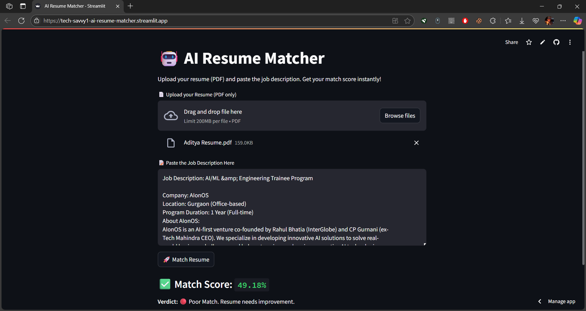

# 🤖 AI Resume Matcher

AI Resume Matcher is a smart Streamlit web app that compares your resume with a job description and gives an instant match score using sentence embeddings.

🔗 **Live App**: [Click to Try Now](https://tech-savvy1-ai-resume-matcher.streamlit.app/)

## 🚀 Features

- 📄 Upload your resume (PDF)
- 📝 Paste the job description
- 🤖 Get a smart match score using Sentence Transformers
- 💡 See feedback based on score (Great | Okay | Poor)
- ⚡ Fast, lightweight & browser-based

## 📸 Screenshot

Here's a preview of the app in action:



## 🛠️ Tech Stack

- Python 3
- Streamlit
- PyPDF2
- sentence-transformers (MiniLM model)

## 💡 How It Works

- ✅ Extracts raw text from your uploaded **PDF resume**
- 🧠 Embeds both **resume and job description** using `all-MiniLM-L6-v2` from SentenceTransformers
- 📐 Calculates **cosine similarity** between both embeddings
- 🎯 Outputs a **match percentage** and a verdict:
  - **>75%** → Great Match ✅  
  - **40-75%** → Okay Match ⚠️  
  - **<40%** → Poor Match ❌

## 📦 Installation & Running Locally

```bash
# Clone the repository
git clone https://github.com/tech-savvy1/AI-Resume-Matcher.git
cd AI-Resume-Matcher

# Install dependencies
pip install -r requirements.txt

# Run the app
streamlit run app.py
