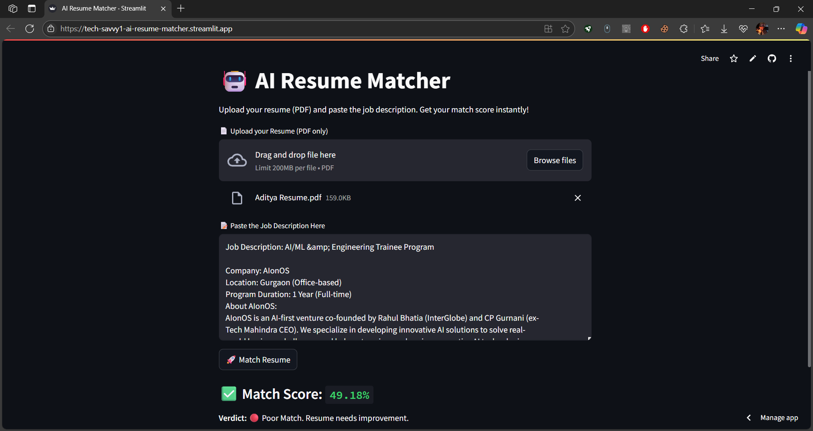

# 🤖 AI Resume Matcher

AI Resume Matcher is a smart Streamlit web app that compares your resume with a job description and gives an instant match score using sentence embeddings.

## 🚀 Features

- 📄 Upload your resume (PDF)
- 📝 Paste any job description
- 🎯 Get a match score with smart feedback (Great / Okay / Poor)
- ⚡ Powered by `sentence-transformers` and `Streamlit`

## 📸 Screenshot




## 🛠️ Tech Stack

- Python 3
- Streamlit
- PyPDF2
- sentence-transformers (MiniLM model)

## 💻 How to Run Locally

1. Clone the repo:
   ```bash
   git clone https://github.com/tech-savvy1/AI-Resume-Matcher.git
   cd AI-Resume-Matcher
